## 重要步骤与代码

### 导入数据集与预处理

#### transforms.Compose

需要使用下面的语句导入

```
from torchvision import transforms
```

**transforms.Compose**: `transforms.Compose` 是PyTorch中用于图像预处理的一个函数，它允许你将多个图像转换操作组合成一个序列。在这段代码中，`transforms.Compose` 包含两个转换操作：

- `transforms.ToTensor()`: 将PIL图像或Numpy数组转换为`FloatTensor`，并将数值范围从[0, 255]压缩到[0.0, 1.0]。
- `transforms.Normalize((0.1307,), (0.3081,))`: 对图像进行标准化处理，其中0.1307，0.3081分别是MNIST数据集的均值和标准差，用于加速训练过程并提高模型性能。


#### datasets

需要使用下面的语句导入

```
from torchvision import datasets
```

参数：

- root：str类型，没有默认值，需要显示给出，这里我写的是`'./data'`，即在当前文件目录下的`data`目录，如果没有的话，该代码会自动创建
- train：bool类型。指是否为训练集，默认为True，若指定为False，则为测试集
- download：bool类型。指是否在线下载，并将数据集放在上面指定的`root`路径下，默认为False。另外需要特意注意，如果`root`路径已经有数据集了，这时候即便`download=True`也不会下载的
- transform：即上面所说的transform对象

```python
train_dataset = datasets.MNIST('./data', train=True, download=True, transform=transform)
test_dataset = datasets.MNIST('./data', train=False, transform=transform)
```

这两行代码会自动联网下载MNIST数据集，并将数据集保存到指定的`./data`目录下，如下图

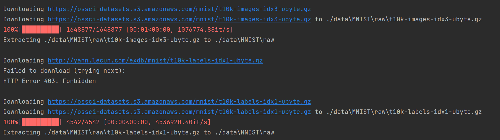

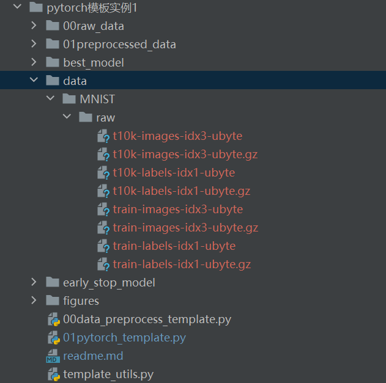


#### MNIST的数据格式

```python
# 假设img是一个PIL图像
img = datasets.MNIST('./data', train=True, download=True)
# 获取第一个样本
first_sample = img[0]
# 获取第一个样本的图像和标签
first_image, first_label = first_sample[0], first_sample[1]
print("first_image ",first_image)
print("first_label ",first_label)
print("img shape",type(img[1][0]))
# 应用转换
transformed_img = transform(img[1][0])
print("transformed_img shape",transformed_img.shape)
```

我们运行代码，运行结果如下图所示：

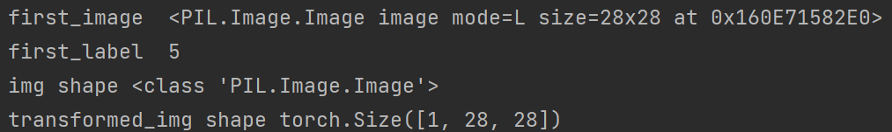

即MNIST的图片是PIL格式

- `img[i]`代表第i个图片
- `img[i][0]`代表第i个图片的训练集（如果要表示测试集的话，只需要吧上面的train参数改为False即可），即1x28x28的张量，代表颜色通道x横轴像素点x纵轴像素点
- `img[i][1]`代表第i个图片的标签，数据格式是整形，代表这个图片写的数字

#### DataLoader

`DataLoader` 是PyTorch中用于加载数据的类，它可以迭代地提供数据批次。在这段代码中，`DataLoader` 的参数包括：

- `train_dataset`: 要加载的数据集。
- `batch_size=64`: 每个批次的样本数量。
- `shuffle=True`: 在每个epoch开始时是否打乱数据。

```python
# 创建DataLoader实例
dataloader = DataLoader(train_dataset, batch_size=64, shuffle=True)
# 迭代DataLoader
for idx, (data_x, data_y) in enumerate(dataloader):
    # 在这里可以执行训练操作，idx是索引下标，data_x是图像数据，data_y是对应的标签
```


### 构造模型与前向传播

定义模型需要导入下面的库，下面库的安装请自行查找

```python
import torch
import torch.nn as nn
```


```python
class Your_model_Name(nn.Module):
    # hidden_size是数组，另外两个是数字
    def __init__(self, input_size, hidden_size, output_size):
        super(Your_model_Name, self).__init__()
        self.input_size = input_size
        self.hidden_size = hidden_size
        self.output_size = output_size


        self.fc1=nn.Linear(input_size,hidden_size[0])
        self.fc2=nn.Linear(hidden_size[0],hidden_size[1])
        self.fc3=nn.Linear(hidden_size[1],output_size)


        pass

    def forward(self, x):
        x=x.view(x.size(0),-1)
        x=torch.relu(self.fc1(x))
        x = torch.relu(self.fc2(x))
        x = self.fc3(x)
        return x

```

这里的`hidden_size`是超参数`args`的成员属性，是列表格式

MNIST数据集只需要最简单的全连接层即可完成较高准确率的分类

由于集成了`nn.Module`，所以必须实现`forward`函数，并且需要在`__init__`里面执行` super(Your_model_Name, self).__init__()`这个代码

由于MNIST数据集的训练集和测试集数据都是1x28x28的数据，所以我们将其展开成一维数组，即`x=x.view(x.size(0),-1)`，-1表示-1所在的维度自动调整，调整规则是相除规则，我们可以打印一下forward的x参数的数据格式：

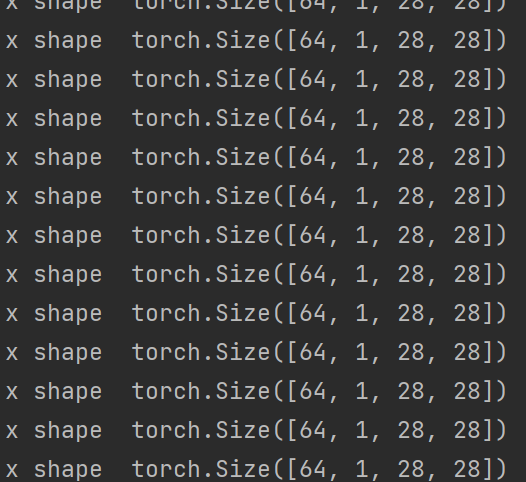

即x是batch_sizex1x28x28的张量，所以这里`forward`函数的x输入参数的`batch_size`默认都是第1维度的，即下标0。所以这里的x执行完成后变成`batch_sizex784`的张量

这样input_size就为784，hidden_size随机，output_size为10，因为我们的任务就是识别出0-9的数字，这样第22行返回的x实际上就是`batch_sizex10`的张量

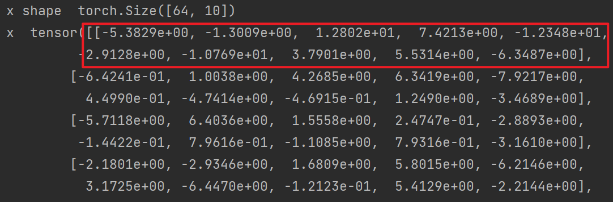

在训练过程中返回的x就是`64x10`的张量。

这里由于batch_size=64，也就是有64张图片，那么每一张图片都对应一个含有10个元素的数组，这个数组中最大的值所在的下标即为预测的标签

如下面的一个2x10的数组：

```python
[
    [0.1 0.2 0.3 0.5 0.1 0.2 0.3 0.5 0.4 0.2],
    [0.1 0.2 0.3 0.4 0.1 0.2 0.3 0.5 0.4 0.7]
]
```

他们对应的最大值的下标分别是3和9，所以预测得到的就是数字3和9

对应的找下标和计算准确率的代码已经封装在`template_utils.py`中，具体代码如下所示

```python
def calculate_accuracy(outputs, labels):
    _, predicted_index = torch.max(outputs, 1)  # predicted_index 即 分类类别
    total = labels.size(0)
    correct = (predicted_index == labels).sum().item()
    accuracy = correct / total
    return accuracy
```

### 计算损失——交叉熵损失

```python
criterion = torch.nn.CrossEntropyLoss()
```

交叉熵损失（Cross-Entropy Loss）是机器学习和深度学习中常用的损失函数之一，尤其在分类问题中。它衡量的是模型预测的概率分布与真实标签的概率分布之间的差异。交叉熵损失越小，表示模型的预测越接近真实标签。

**作用：**

1. **分类问题中的损失度量**：在多分类问题中，交叉熵损失可以用来衡量模型预测的类别概率与实际类别之间的差异。
2. **优化目标**：在训练过程中，通过最小化交叉熵损失，可以指导模型学习到更准确的分类边界。
3. **概率解释**：交叉熵损失提供了一种概率解释，即模型预测的概率分布与真实标签的概率分布之间的差异。

**用法：**

在PyTorch框架中，交叉熵损失可以通过`torch.nn.CrossEntropyLoss()`创建。使用时，需要提供模型的输出和目标标签。

- **模型输出**：模型输出通常是一个概率分布，即每个类别的预测概率。
- **目标标签**：通常是类别的索引，表示真实标签。

**数学公式：**

假设有\( $C$ \)个类别，对于一个样本，模型输出的概率分布为\( $p = [p_1, p_2, ..., p_i]$ \)，其中\( $p_i$ \)是模型预测样本属于第\( $i $\)个类别的概率。真实标签为\( $y$ \)，可以表示为一个独热编码向量\( $t = [t_1, t_2, ..., t_C]$ \)，其中当\( $i = y$ \)时\($ t_i = 1$ \)，否则\($ t_i = 0$ \)。

交叉熵损失的数学公式为：
$$
L = -\sum_{i=1}^{C} t_i \log(p_i)
$$
其中，\( $$t_i$$ \)是目标标签中第\( $i$\)个类别的值，\( $$p_i$$ \)是模型预测样本属于第\( $i$\)个类别的概率，$log $ 以自然对数 $e$ 为底。

在PyTorch中，`nn.CrossEntropyLoss`函数实际上执行了两个操作：首先，它对模型输出进行`softmax`操作用于计算$p_i$ ，即模型预测样本属于第 $i$ 个类别的概率；然后它再通过上面的交叉熵损失函数计算了交叉熵损失。这意味着，当你传递模型输出给这个损失函数时，它并不是直接对原始输出进行对数运算，而是先将其转换为概率分布的对数。
$$
p_i=softmax(x_i) = \frac{e^{x_i} }{\sum(e^{x_j})}
$$
**例子：**

假设有一个简单的分类问题，有两个类别，模型输出的概率分布为\( $p = [0.7, 0.3]$ \)，真实标签为第二个类别（索引为1），则目标标签的独热编码为\( $t = [0, 1]$ \)。

交叉熵损失计算为：
$$
softmax([0.7,0.3])=[\frac{e^{0.7}}{e^{0.7}+e^{0.3}},\frac{e^{0.3}}{e^{0.7}+e^{0.3}}]
$$

$$
L = -(0 \cdot \log(\frac{e^{0.7}}{e^{0.7}+e^{0.3}}) + 1 \cdot \log(\frac{e^{0.3}}{e^{0.7}+e^{0.3}}))
$$

$$
L = -(\log(\frac{e^{0.3}}{e^{0.7}+e^{0.3}}))\approx 0.9130
$$

在实际应用中，为了避免对数为负无穷的情况，通常会使用`log_softmax`函数来计算模型输出的对数概率，这样可以保证数值的稳定性。

**PyTorch代码示例：**

```python
import torch
import torch.nn as nn

# 创建交叉熵损失函数
criterion = nn.CrossEntropyLoss()

# 假设模型输出和目标标签
outputs = torch.tensor([[0.7, 0.3]])
targets = torch.tensor([1])

# 计算损失
loss = criterion(outputs, targets)
print(loss)  # 输出损失值
```

在实际应用中，交叉熵损失通常与softmax激活函数结合使用，以确保模型输出为概率分布。在PyTorch中，可以通过`nn.CrossEntropyLoss`自动应用`log_softmax`，因此不需要手动计算对数概率。

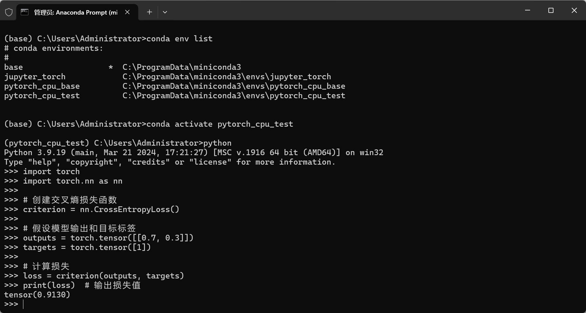

手动计算：

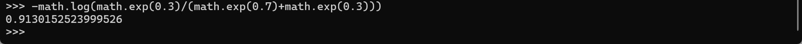


### 优化器——Adam

```python
optimizer = torch.optim.Adam(model.parameters(), lr=args.original_lr)
```

**原理：**

Adam（Adaptive Moment Estimation）是一种自适应学习率优化算法，它结合了动量（Momentum）和RMSprop（Root Mean Square Propagation）的思想。Adam优化器旨在处理非平稳目标的问题，即当目标函数的几何形状在训练过程中发生变化时，它能够自适应地调整学习率。

**数学公式：**

Adam算法的核心是维护两个动态更新的估计值：梯度的一阶矩估计（即均值）和二阶矩估计（即非中心化的方差）。

1. **一阶矩估计（动量）**:
   $$
   m_t = \beta_1 m_{t-1} + (1 - \beta_1) g_t
   $$
   其中，\( $m_t$ \) 是第 \( $t$ \) 次迭代的一阶矩估计，\( $g_t$ \) 是当前梯度，\( $\beta_1$ \) 是超参数（通常设为0.9）。

2. **二阶矩估计（RMSprop）**:
   $$
   v_t = \beta_2 v_{t-1} + (1 - \beta_2) g_t^2
   $$
   其中，\( $v_t$ \) 是第 \( $t$ \) 次迭代的二阶矩估计，\( $\beta_2$ \) 是超参数（通常设为0.999）。

3. **修正的一阶矩估计**:
   $$
   \hat{m}_t = \frac{m_t}{1 - \beta_1^t}
   $$

4. **修正的二阶矩估计**:
   $$
   \hat{v}_t = \frac{v_t}{1 - \beta_2^t}
   $$

5. **参数更新**:
   $$
   \theta_{t+1} = \theta_t - \alpha \frac{\hat{m}_t}{\sqrt{\hat{v}_t} + \epsilon}
   $$
   其中，\( $\theta_t$ \) 是当前参数，\( $\alpha$ \) 是学习率，\( $\epsilon$ \) 是一个很小的常数，用来保证数值稳定性。

**步骤：**

假设有一个简单的线性模型，参数为 \( $\theta$ \)，损失函数为 \( $L$ \)。在训练过程中，我们希望最小化损失函数。

1. 计算损失函数 \( $L$ \) 关于参数 \( $\theta$ \) 的梯度 \( $g_t$ \)。
2. 使用Adam优化器更新参数：
   - 计算一阶矩估计 \( $m_t$ \) 和二阶矩估计 \( $v_t$ \)。
   - 计算修正的一阶矩估计 \( $\hat{m}_t$ \) 和二阶矩估计 \( $\hat{v}_t$ \)。
   - 更新参数 \( $\theta_{t+1} $\)。

**例子：**

假设我们有一个非常简单的模型，它只有一个参数 \( $\theta$ \)，并且我们的目标是最小化以下简单的二次损失函数：
$$
L(\theta) = (\theta - 2)^2
$$
在这个例子中，真实的最小值 \( $\theta$ \) 应该是2，因为这时损失函数 \( $L(\theta)$ \) 为0。我们将使用Adam优化器来找到这个最小值。

初始化参数和优化器变量：

- 初始参数 \( $\theta_0 = 0$ \)（我们可以从0开始）
- 初始一阶矩 \( $m_0 = 0 $\) 和二阶矩 \( $v_0 = 0$ \)
- 学习率 \( $\alpha = 0.001$ \)
- 一阶矩估计的指数衰减率 \( $\beta_1 = 0.9$ \)
- 二阶矩估计的指数衰减率 \( $\beta_2 = 0.999$ \)
- \( $\epsilon = 1e-8$ \) 用于数值稳定性

手动执行Adam优化的第一步：

1. **计算梯度**：
   $$
   g_1 = \frac{dL}{d\theta} = 2(\theta_0 - 2)
   $$
   代入 \( $\theta_0 = 0$​ \) 得：
   $$
   g_1 = 2(0 - 2) = -4
   $$

2. **更新一阶矩估计**：
   $$
   m_1 = \beta_1 m_0 + (1 - \beta_1) g_1 = 0.9 \cdot 0 + (1 - 0.9) \cdot (-4) = -0.4
   $$

3. **更新二阶矩估计**：
   $$
   v_1 = \beta_2 v_0 + (1 - \beta_2) g_1^2 = 0.999 \cdot 0 + (1 - 0.999) \cdot 16 = 0.016
   $$

4. **计算修正的一阶矩估计**：
   $$
   \hat{m}_1 = \frac{m_1}{1 - \beta_1} = \frac{-0.4}{1 - 0.9} = -4
   $$

5. **计算修正的二阶矩估计**：
   $$
   \hat{v}_1 = \frac{v_1}{1 - \beta_2} = \frac{0.016}{1 - 0.999} = 1.6
   $$

6. **更新参数**：
   $$
   \theta_1 = \theta_0 - \alpha \frac{\hat{m}_1}{\sqrt{\hat{v}_1} + \epsilon}
   $$

   $$
   \theta_1 = 0 - 0.001 \frac{-4}{\sqrt{1.6} + 1e-8} \approx 0.001 \cdot \frac{-4}{1.26491 + 1e-8} \approx 0.001 \cdot -3.1623 \approx -0.0031623
   $$

   

所以，手动执行了Adam优化的第一步后，我们更新了参数 \( $\theta$ \) 从$0$变为 \( $\theta_1 \approx -0.0031623$ \)。

继续迭代：

你可以继续这个过程，使用 \( $\theta_1$ \) 作为新的起点，重复上述步骤来更新 \( $\theta$ \)。随着迭代的进行，\( $\theta$ \) 将逐渐接近最小值2。

请注意，这个例子非常简化，实际的深度学习模型会有多个参数，损失函数也会更复杂。此外，实际应用中我们通常不会手动执行这些步骤，而是会依赖于深度学习框架提供的优化器实现。


### 设置模板超参数

```python
def main():
    ''' 设置随机种子'''
    seed = 42
    torch.manual_seed(seed)
    np.random.seed(seed)
    random.seed(seed)

    ''' 设置超参数'''
    # 数据集默认就是在代码同级的
    # 这个路径和名字可以随便改，但是三者的顺序不能变动，一定是训练集、验证集、测试集 且都是只有最后一列是标签
    csv_paths = ['./01preprocessed_data/train_data/',
                 './01preprocessed_data/valid_data/',
                 './01preprocessed_data/test_data/']
    # 输入层
    input_size = 784 

    # 输出层
    output_size = 10
    # 训练次数
    epochs = 10
    # 学习率
    original_lr = 0.001
    # 耐心
    patience = 4
    # gpu设备
    cuda_id = 0
    # 学习率调整 epoch：lr
    lr_adjust = {
        2: 5e-5, 4: 1e-5, 6: 5e-6, 8: 1e-6,
        10: 5e-7, 15: 1e-7, 20: 5e-8
    }
    # 寻找最优网络结构次数
    search_net_num = 5

    for i in range(search_net_num):
        # 隐藏层 从前往后
        hidden_size = [random.randint(250, 260), random.randint(120, 130)]
        args = argparse(hidden_size=hidden_size, input_size=input_size, output_size=output_size,
                        epochs=epochs,
                        original_lr=original_lr, lr_adjust=lr_adjust, patience=patience, cuda_id=cuda_id)
        train(args, csv_paths)
```

超参数解释：

- csv_paths：这里不太需要改，但是这里为了有多个图像的对比，我在`01preprocessed_data`里创建了2个没有意义的csv文件，在这里仅仅用作多次循环以求取最好的网络结构和最高准确率

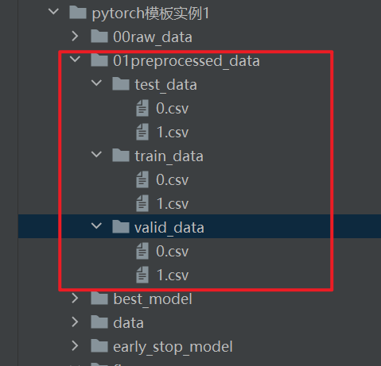

- original_lr：表示刚开始的学习率，一定要指定

- patience：表示能够接受多少次的损失下降很低的情况，这个阈值默认为0，即不下降，可以在`EarlyStopping(patience=7, verbose=False, delta=0)`改阈值delta

- cuda_id：指gpu的id，这里如果没有gpu的话会自动采用cpu，获取电脑或服务器的cuda_id

  ```python
  import torch
  
  # 获取可用GPU的数量
  num_gpus = torch.cuda.device_count()
  print(f"Number of available GPUs: {num_gpus}")
  
  # 遍历每个GPU并打印其序号和名称
  for i in range(num_gpus):
      print(f"GPU {i}: {torch.cuda.get_device_name(i)}")
  
  ```

  

- lr_adjust：使用字典格式，键表示epoch，值表示学习率，即在不同的epoch采用的学习率是不一样的，学习率一般是先大后小

- search_net_num：寻找最优网络结构次数

- hidden_size：是数组形式，这个的设置需要结合定义的模型

### 训练/验证/测试

```python
avg_loss, avg_acc, _,_, model, optimizer = evaluate(dataloader=train_dataloader, model=model,
                                                              device=args.device,
                                                              flag='train',
                                                              criterion=criterion, optimizer=optimizer, epoch=epoch+1,
                                                              epochs=args.epochs)
```

训练、验证和测试都是使用封装好的`evaluate`函数，各参数如下：

- dataloader：即数据集
- model：即自定义的神经网络模型
- device：即gpu或cpu
- flag：只能取`'train','valid','test'`三个值，分别代表训练，验证和测试，由于MNIST没有验证集，所以也没有验证的环节
- criterion：即损失函数对象
- optimizer：即优化器对象
- epoch：即epoch+1，这里加1是为了让epoch从1开始，这样打印会很方便
- epochs：即有多少个epoch

evaluate从左到右的返回值分别为：`np.average(valid_loss), np.average(accuracys), accuracys,valid_loss, model, optimizer`

- np.average(valid_loss)：即某一个epoch的平均损失，是一个值，而不是多个值
- np.average(accuracys)：即某一个epoch的平均准确率，是一个值，而不是多个值
- accuracys：如果是测试集，则为某个csv文件所有epochs的准确率数组。如果是训练集，则是某个epoch的准确率数组
- valid_loss：如果是测试集，则为某个csv文件所有epochs的损失数组。如果是训练集，则是某个epoch的损失数组
- model：训练完成后的模型
- optimizer：训练完成后的优化器


## 全部代码

### 01pytorch_template.py

```python
'''
只需要更改模型和训练方式即可

以下函数和类已定义好，可以直接调用，以下的'保存'路径均不用考虑是否存在问题
评估：evaluate(dataloader, model, device, flag, criterion, optimizer=None, epoch=None, epochs=None):
    返回平均损失，某次batch的平均准确率，测试准确率（数组）,model,optimizer  flag='valid' / 'test' / 'train'
自定义数据集：Dataset_name(flag='train', csv_paths=None))
超参数类：argparse(self, csv_paths, hidden_size=None, lr_adjust=None, input_size=30, output_size=12, epochs=30,
                 original_lr=0.001,
                 patience=4, cuda_id=0):仅argparse.device="cuda:cuda_id" 其余返回值都跟参数名称一样
早停类：EarlyStopping(patience=7, verbose=False, delta=0) verbose是否打印信息 其对象属性值early_stop为True时表示早停
保存模型（保存）：save_checkpoint(model, optimizer, epoch=None, filepath='./best_model/1.pth')
加载模型：load_checkpoint(filepath, model, optimizer, device):model, optimizer, epoch,hidden_size
画图（保存）：save_figure(train_loss, train_epochs_loss, valid_epochs_loss,save_path="./total_loss_figs/1.png")
'''

''' 导入包'''
import numpy as np
import torch
import torch.nn as nn
import numpy as np
import pandas as pd
from torch.utils.data import DataLoader, Dataset
from sklearn.model_selection import train_test_split
import matplotlib.pyplot as plt
import random
import os
from torchvision import transforms,datasets

'''导入自定义模板工具函数及类'''
from template_utils import Dataset_name, argparse, evaluate, EarlyStopping, load_checkpoint, save_figure, \
    save_checkpoint, calculate_accuracy

# --------------------------------------------   一般只用改下面的实现  -------------------------------------------------------------------
''' 定义自己的模型'''


class Your_model_Name(nn.Module):
    # hidden_size是数组，另外两个是数字
    def __init__(self, input_size, hidden_size, output_size):
        super(Your_model_Name, self).__init__()
        self.input_size = input_size
        self.hidden_size = hidden_size
        self.output_size = output_size


        self.fc1=nn.Linear(input_size,hidden_size[0])
        self.fc2=nn.Linear(hidden_size[0],hidden_size[1])
        self.fc3=nn.Linear(hidden_size[1],output_size)


        pass

    def forward(self, x):
        # print("x shape ",x.shape)
        x=x.view(x.size(0),-1)
        x=torch.relu(self.fc1(x))
        x = torch.relu(self.fc2(x))
        x = self.fc3(x)
        # print("x shape ",x.shape)
        # print("x ",x)
        return x


def train(args, csv_paths):
    csv_files = os.listdir(csv_paths[0])
    csv_files.sort()

    train_total_acc = []
    valid_total_acc = []
    test_total_acc = []
    train_total_loss = []
    valid_total_loss = []
    test_total_loss = []
    '''实例化模型，设置loss，优化器等'''
    model = Your_model_Name(args.input_size, args.hidden_size, args.output_size).to(args.device)
    criterion = torch.nn.CrossEntropyLoss()
    optimizer = torch.optim.Adam(model.parameters(), lr=args.original_lr)
    early_stopping = EarlyStopping(patience=args.patience, verbose=True)

    for csv_file in csv_files:

        # 这个数据集只是单个文件的，即单个被试的，如果需要多个的话则需要自行改成循环结构
        # 数据加载
        transform = transforms.Compose([
            transforms.ToTensor(),
            transforms.Normalize((0.1307,), (0.3081,))
        ])
        train_dataset = datasets.MNIST('./data', train=True, download=True, transform=transform)
        test_dataset = datasets.MNIST('./data', train=False, transform=transform)
        train_dataloader = DataLoader(train_dataset, batch_size=64, shuffle=True)
        test_dataloader = DataLoader(test_dataset, batch_size=1000, shuffle=False)

        # # 假设img是一个PIL图像
        # img = datasets.MNIST('./data', train=True, download=True)
        # # 获取第一个样本
        # first_sample = img[0]
        # # 获取第一个样本的图像和标签
        # first_image, first_label = first_sample[0], first_sample[1]
        # print("first_image ",first_image)
        # print("first_label ",first_label)
        # print("img shape",type(img[1][0]))
        # # 应用转换
        # transformed_img = transform(img[1][0])
        # print("transformed_img shape",transformed_img.shape)

        # 现在transformed_img是一个torch.FloatTensor，数值范围在[0.0, 1.0]，并且已经标准化


        train_epochs_loss = []
        valid_epochs_loss = []
        train_epochs_accuracy = []
        valid_epochs_accuracy = []

        for epoch in range(args.epochs):
            # ===================train===============================
            avg_loss, avg_acc, _,_, model, optimizer = evaluate(dataloader=train_dataloader, model=model,
                                                              device=args.device,
                                                              flag='train',
                                                              criterion=criterion, optimizer=optimizer, epoch=epoch+1,
                                                              epochs=args.epochs)
            train_epochs_loss.append(avg_loss)
            train_epochs_accuracy.append(avg_acc)

            # =====================valid============================
            # avg_loss, avg_acc, _,_,_ = evaluate(dataloader=valid_dataloader, model=model, device=args.device,
            #                                 flag='valid',
            #                                 criterion=criterion)
            # valid_epochs_loss.append(avg_loss)
            # valid_epochs_accuracy.append(avg_acc)

            # ==================early stopping======================
            early_stopping(train_epochs_loss[-1], model=model, path='./early_stop_model/'+str(round(avg_acc,4))+'.pth')
            if early_stopping.early_stop:
                print("Early stopping")
                break
            # ====================adjust lr========================
            if args.lr_adjust is not None:
                if epoch in args.lr_adjust.keys():
                    lr = args.lr_adjust[epoch]
                    for param_group in optimizer.param_groups:
                        param_group['lr'] = lr
                    print('Updating learning rate to {}'.format(lr))

        # ======================= 找到最佳模型 ===================================
        avg_loss, avg_acc, accs,test_losses, _,_  = evaluate(dataloader=test_dataloader, model=model, device=args.device,
                                              flag='test',
                                              criterion=criterion)
        # ====================== 汇总 ====================================
        train_total_loss.append(np.average(train_epochs_loss))
        train_total_acc.append(np.average(train_epochs_accuracy))
        valid_total_loss.append(np.average(valid_epochs_loss))
        valid_total_acc.append(np.average(valid_epochs_accuracy))
        test_total_acc.append(avg_acc)
        test_total_loss.append(avg_loss)
        pre_acc = 0

        csv_path='./best_model/csvs/'+csv_file[:-4]
        if not os.path.exists(csv_path):
            os.mkdir(csv_path)
        best_model_files = os.listdir(csv_path)
        best_model_files.sort()
        now_acc = np.average(test_total_acc)
        if len(best_model_files):
            pre_acc = float(best_model_files[-1][:-4])
        if now_acc > pre_acc:
            save_figure(train_epochs_accuracy, valid_epochs_accuracy,accs,
                        save_path='./figures/csvs_acc_figs/'+csv_file[:-4]+ '/' + str(round(now_acc, 4)) + '.png')
            save_figure(train_epochs_loss, valid_epochs_loss,test_losses,
                        save_path='./figures/csvs_loss_figs/'+csv_file[:-4]+ '/' + str(round(now_acc, 4)) + '.png')
            save_checkpoint(model, optimizer, hidden_size=args.hidden_size,
                            filepath='./best_model/csvs/'+csv_file[:-4]+ '/' + str(round(now_acc, 4)) + '.pth')

    pre_acc = 0
    best_model_files = os.listdir('./best_model/total/')
    best_model_files.sort()
    now_acc = np.average(test_total_acc)
    if len(best_model_files):
        pre_acc = float(best_model_files[-1][:-4])
    if now_acc > pre_acc:
        save_figure( train_total_acc, valid_total_acc,test_total_acc,
                    save_path='./figures/total_acc_figs/' + str(round(now_acc, 4))+'.png')
        save_figure( train_total_loss, valid_total_loss,test_total_loss,
                    save_path='./figures/total_loss_figs/' + str(round(now_acc, 4))+'.png')
        save_checkpoint(model, optimizer, hidden_size=args.hidden_size,
                        filepath='./best_model/total/' + str(round(now_acc, 4))+'.pth')


def main():
    ''' 设置随机种子'''
    seed = 42
    torch.manual_seed(seed)
    np.random.seed(seed)
    random.seed(seed)

    ''' 设置超参数'''
    # 数据集默认就是在代码同级的
    # 这个路径和名字可以随便改，但是三者的顺序不能变动，一定是训练集、验证集、测试集 且都是只有最后一列是标签
    csv_paths = ['./01preprocessed_data/train_data/',
                 './01preprocessed_data/valid_data/',
                 './01preprocessed_data/test_data/']
    # 输入层
    input_size = 784

    # 输出层
    output_size = 10
    # 训练次数
    epochs = 10
    # 学习率
    original_lr = 0.001
    # 耐心
    patience = 4
    # gpu设备
    cuda_id = 0
    # 学习率调整 epoch：lr
    lr_adjust = {
        2: 5e-5, 4: 1e-5, 6: 5e-6, 8: 1e-6,
        10: 5e-7, 15: 1e-7, 20: 5e-8
    }
    # 寻找最优网络结构次数
    search_net_num = 5

    for i in range(search_net_num):
        # 隐藏层 从前往后
        hidden_size = [random.randint(250, 260), random.randint(120, 130)]
        args = argparse(hidden_size=hidden_size, input_size=input_size, output_size=output_size,
                        epochs=epochs,
                        original_lr=original_lr, lr_adjust=lr_adjust, patience=patience, cuda_id=cuda_id)
        train(args, csv_paths)
if __name__=='__main__':
    main()
```

## 运行结果

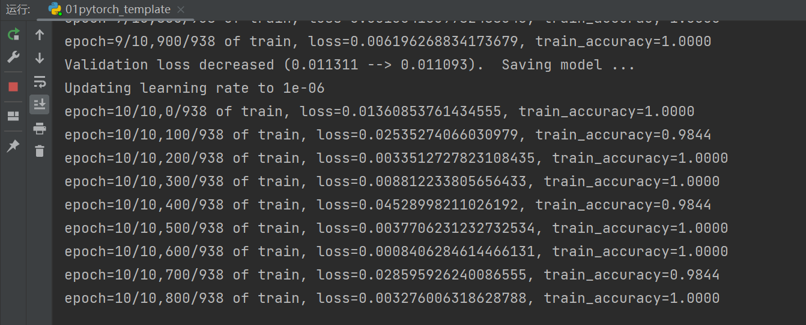

### best_model

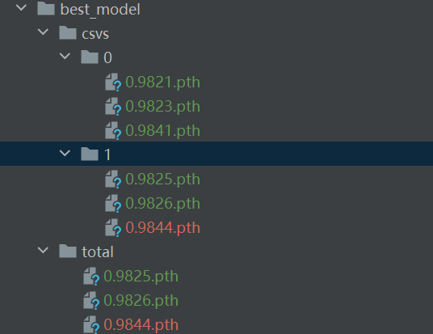

文件名即为准确率

如果要提取网络结构和参数只需调用下面封装好的函数即可：

```python
# filepath为pth路径，model是需要导入的模型
def load_checkpoint(filepath, model, optimizer, device):
    if not os.path.exists(filepath):
        print("该模型不存在")
    checkpoint = torch.load(filepath, map_location=device)
    model.load_state_dict(checkpoint['model_state_dict'])
    optimizer.load_state_dict(checkpoint['optimizer_state_dict'])
    epoch = checkpoint['epoch']
    print(f"Model loaded from {filepath}, epoch {epoch}")
    print("hidden_size=",checkpoint['hidden_size'])
    return model, optimizer, epoch,checkpoint['hidden_size']
```

### figure

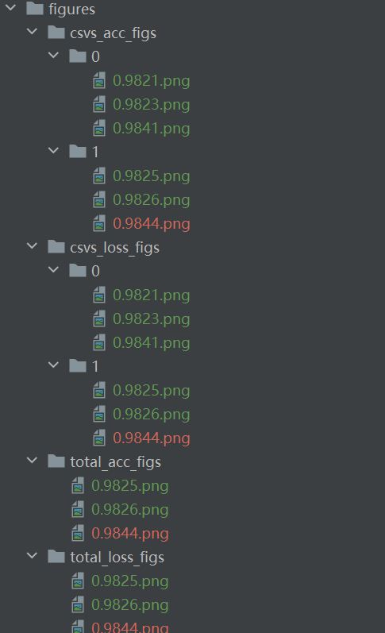

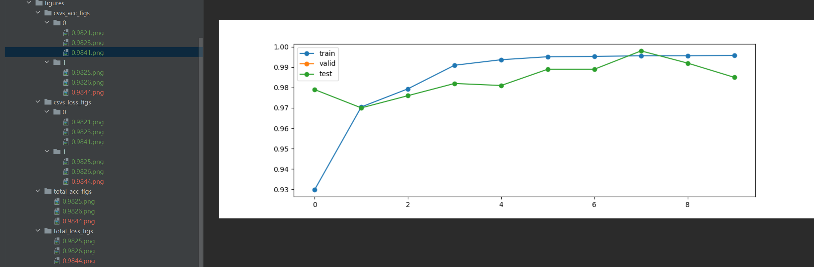

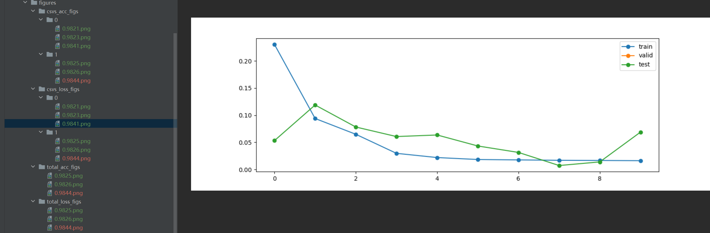

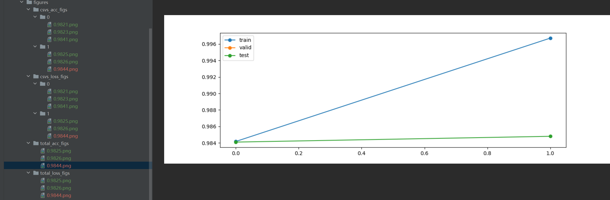

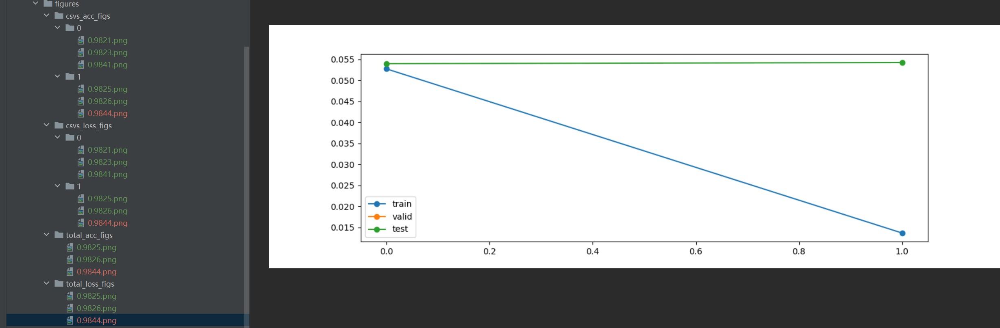

文件名都是一一对应的

