# MNIST实战

## 模板及本节代码地址

github: [1571859588/PyTorch_Template: PyTorch Template is used to finish the model building quickly. (github.com)](https://github.com/1571859588/PyTorch_Template)

对应`02MNIST实战2` 

强烈建议仅使用模板跟着文章复现代码！这样会更加有利于学习！

## 前言

MNIST数据集是一个广泛使用的手写数字数据集，它包含了60,000个训练样本和10,000个测试样本。每个样本是一个28x28像素的灰度图像，代表一个手写数字，从0到9。MNIST数据集是机器学习和计算机视觉领域中用于测试和训练模型的经典数据集之一。

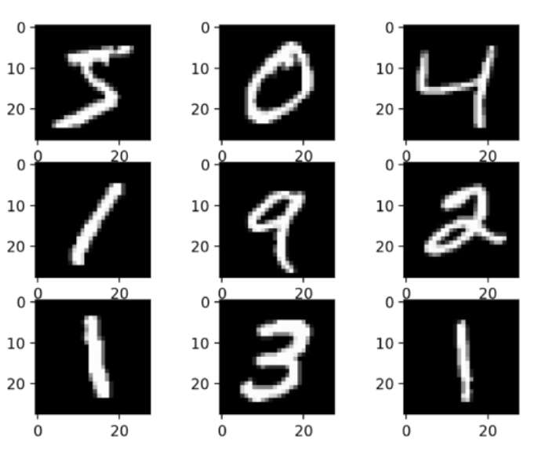

本节我们使用的数据集是MNIST网络资源，所以不需要自己进行数据预处理，即不需要写`00data_preprocess_template.py`这个文件。


本节我们会使用卷积层和池化层讲解模型构建步骤和原理，下一节会使用全连接层进行模型训练，并对比一下全连接层和卷积操作的模型效果。


## 重要步骤与代码


### 导入数据集与预处理

为了简单起见，我们还是使用线上已经处理好的数据集进行实验，后续会慢慢提高难度，前面几节以快速上手为主

```python
# 数据加载
transform = transforms.Compose([
    transforms.ToTensor(),
    transforms.Normalize((0.1307,), (0.3081,))
])
train_dataset = datasets.MNIST('./data', train=True, download=True, transform=transform)
test_dataset = datasets.MNIST('./data', train=False, transform=transform)
train_dataloader = DataLoader(train_dataset, batch_size=64, shuffle=True)
test_dataloader = DataLoader(test_dataset, batch_size=1000, shuffle=False)
```

---


以下内容不是本实验的关键步骤，即便不看也可以做出来，但是看了会对`np.transpose和torchvision.utils.make_grid`函数更加理解

#### np.transpose的用法

上面可以知道`train_dataloader`的批次数目是64，我们显示一个批次的图像

```python
def imshow(img):
    img=img/2+0.5
    print("img shape",img.shape)
    npimg=img.numpy()
    plt.imshow(np.transpose(npimg,(1,2,0)))
    plt.show()
# 显示一个batch的训练集图片
dataiter=iter(train_dataloader)
images,labels=dataiter.__next__()
imshow(torchvision.utils.make_grid(images))
```

这段代码是用于在PyTorch中显示一个批次（batch）的训练集图片。下面是对某些代码的解释：

1. `img = img / 2 + 0.5 # 逆归一化`
   - 这行代码对输入的图片 `img` 进行逆归一化处理。在PyTorch中，训练图像通常会被归一化处理，即将其像素值缩放到 [-1, 1] 的范围内。逆归一化就是将归一化后的像素值恢复到 [0, 1] 的范围内，以便于显示。
2. `npimg = img.numpy()`
   - 这行代码将逆归一化后的图片 `img` 转换为 NumPy 数组，因为 `plt.imshow()` 函数需要 NumPy 数组作为输入。
3. `plt.imshow(np.transpose(npimg, (1, 2, 0)))`
   - 这行代码使用 Matplotlib 的 `plt.imshow()` 函数显示图片。在 PyTorch 中，图片的格式通常是 (channels, height, width)，而 Matplotlib 显示图片需要格式为 (height, width, channels) 的数组，所以使用 `np.transpose()` 来转置数组。参数（1，2，0）表示将npimg的第1个维度（即height）转到第0个维度，将npimg的第2个维度（即width）转到第1个维度，将npimg的第0个维度（即channels）转到第2个维度。这样就可以符合Matplotlib的显示格式了。至于`np.transpose()`其实就是把参数所在维度放到了这个参数所在的括号的下标处（可能这么说会比较好理解一些，可以尝试动手转换一下，`np.transpose()`我们将来会用的很多，所以一定要掌握）
4. `dataiter = iter(train_dataloader)`
   - 这行代码创建一个迭代器 `dataiter`，用于遍历训练数据加载器 `train_dataloader`。
5. `images, labels = dataiter.__next__()`
   - 这行代码获取 `dataiter` 的下一个元素，即一个批次（batch）的图片和标签。
6. `imshow(torchvision.utils.make_grid(images))`
   - 这行代码使用 `torchvision.utils.make_grid()` 函数将一个批次的图片拼接成一个网格，然后调用 `imshow()` 函数显示这个网格。


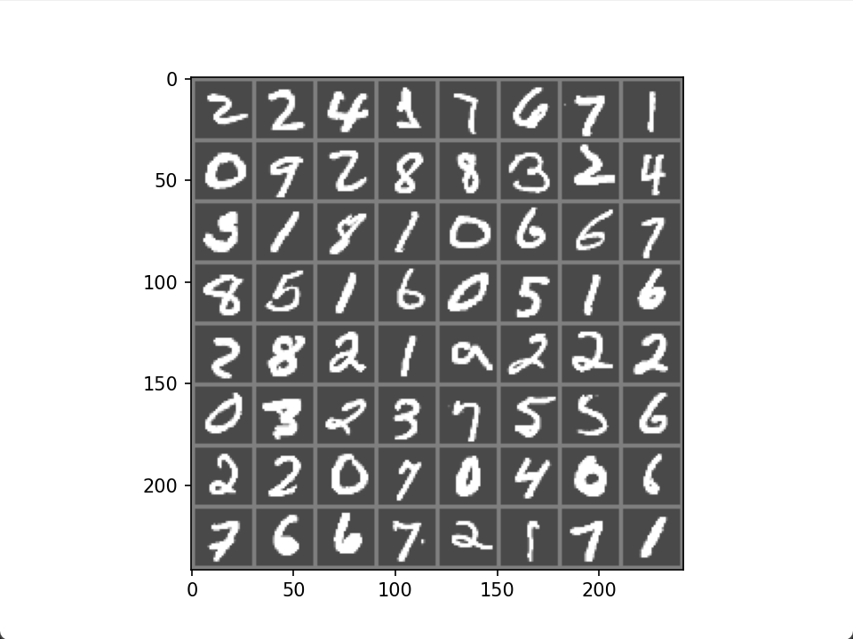

如图，这有64个图像，也就是一个batch的数据，我们打印一下images的数据格式，得到的是`3x242x242` ，因为我们知道一个MNIST图像的数据格式是`1x28x28`的，我们显示一下一个图片：

```python
# 显示一个batch的训练集图片
dataiter=iter(train_dataloader)
images,labels=dataiter.__next__()
# 假设你想显示批次中的第一张图像
image_to_show = images[0]  # 获取第一张图像
imshow(image_to_show)  # 显示第一张图像
```

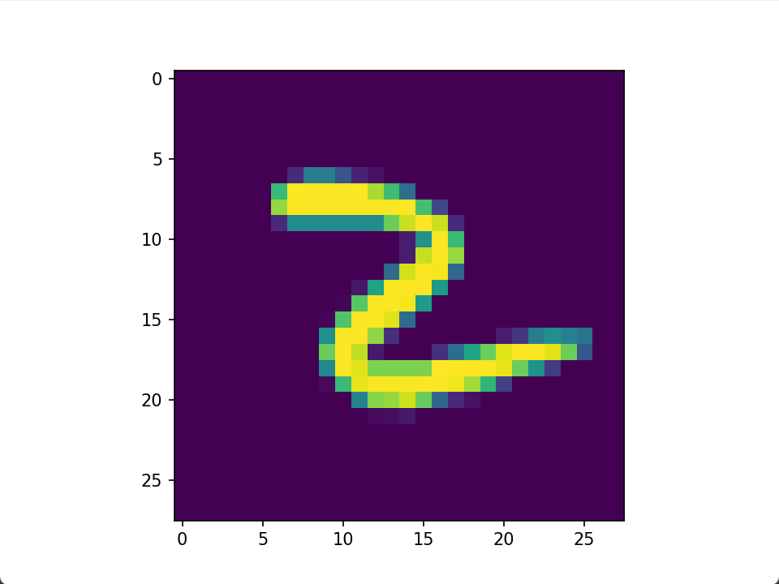

#### torchvision.utils.make_grid的妙处

按理说64个图像按照上述的排列方法来排那应该也是`28x8=224`为什么是`242`呢？

这是因为`torchvision.utils.make_grid` 函数接受一个批次的图像（一个 4D 张量，形状为 [batch_size, channels, height, width]），并将它们组合成一个大的图像网格，以便于可视化。这就是为什么你看到的 `img` 形状是 `3x242x242 `的原因：

- 3 个通道：这通常表示图像是彩色的，具有 RGB 三个颜色通道。然而，MNIST 数据集中的图像是灰度图，只有一个通道。`make_grid` 函数默认会复制灰度通道三次，以创建一个兼容的颜色通道格式。
- 242 像素的高度：这是由 `make_grid` 函数计算得出的，它取决于原始图像的大小（28x28 像素）和批次大小（64 张图像）。`make_grid` 会将这些图像排列成一个大约正方形的网格，因此高度和宽度都会增加。
- 242 像素的宽度：这是与高度相同的过程，以适应整个图像网格。

`make_grid` 函数会根据批次大小即64，来计算高度和宽度，这样就可以计算出8行8列，此外`make_grid` 函数会在图像之间添加填充（padding），以便在网格中的每张图像之间创建间隔。默认情况下，这个填充是 2 像素。因此，每个图像的实际占用空间是图像尺寸加上两边的填充：

可以根据上面一个批次的图看出来，在横轴和纵轴方向分别添加了9条间隔，那么就可以通过下面计算方法得到242像素：

`8x28+9x2=242`

那么这样我们就更加了解了这个函数。


### 构造模型与前向传播

```python
dataiter=iter(train_dataloader)
images,labels=dataiter.__next__()
print("images shape",images.shape)
```

通过上述代码，我们可以得到一个批次的数据格式是`64x1x28x28`的，那么我们就可以根据这个数据格式进行模型构造了

```python
import torch
import torch.nn as nn
import torch.nn.functional as F # 可以调用一些常见的函数，如非线性和池化等
# hidden_size是数组，另外两个是数字
    def __init__(self, input_size, hidden_size, output_size):
        super(Your_model_Name, self).__init__()
        self.input_size = input_size
        self.hidden_size = hidden_size
        self.output_size = output_size
        self.conv1 = nn.Conv2d(1, 6, 5)
        self.conv2 = nn.Conv2d(6, 16, 5)
        self.fc1 = nn.Linear(16 * 4 * 4, hidden_size[0])
        self.fc2 = nn.Linear(hidden_size[0], hidden_size[1])
        self.fc3 = nn.Linear(hidden_size[1], output_size)

        pass

    def forward(self, x):
        print("x forward shape ",x.shape) # x=64x1x28x28
        # x=x.view(x.size(0),-1)
        x = F.max_pool2d(F.relu(self.conv1(x)), (2, 2))  # 横纵方向步长为2  # x=64x6x12x12
        x = F.max_pool2d(F.relu(self.conv2(x)), 2)  # (2,2)也可以像这样写成2 # x=64x16x4x4
        x = x.view(-1, self.num_flat_features(x)) # x= 64x256

        x = F.relu(self.fc1(x))  # x= 64 x hidden_size[0]
        x = F.relu(self.fc2(x))  # x= 64 x hidden_size[1]
        x = self.fc3(x)   # x= 64 x output_size
        print("x shape ",x.shape)  # x = 64 x 10
        # print("x ",x)
        return x

    def num_flat_features(self, x): # x=64x16x4x4
        print("x1 shape",x.shape)
        size = x.size()[1:]  # 忽略第0维度，提取第1维度以及后面的维度
        print('size ',size) #size=16x4x4

        num_features = 1
        for s in size:
            num_features *= s
        print("num_features ",num_features)
        return num_features # num_features=256
```

**计算输出特征图的大小**：输出特征图 \( $O$ \) 的大小可以通过以下公式计算：
$$
O_w = \left\lfloor \frac{I_w - K_w + 2P}{S} + 1 \right\rfloor
$$

$$
O_h = \left\lfloor \frac{I_h - K_h + 2P}{S} + 1 \right\rfloor
$$

其中，卷积核 \( $k$ \) 通常是一个正方形矩阵，其大小由 \( $K_h \times K_w$ \) 表示，其中 \( $K_h$ \) 是高度，\( $K_w$ \) 是宽度。

步长 \( $S$ \) 决定了卷积核在输入图像上滑动的间隔，填充 \( $P$ \) 是在输入图像边缘添加的零值边界。

\( $I_w$ \) 和 \( $I_h$ \) 分别是输入图像的宽度和高度。

**构造模型和前向传播：**

1. 输入参数`x` ，数据格式为`64x1x28x28` ，即`batch_sizex1x28x28`
2. `Conv2d(1,6,5)` ：conv1的输入通道是1，即MNIST数据集是的颜色通道是1，只有灰度图，也就是对应`1x28x28`的1；这一层有6个卷积核，每个卷积核的大小是`5x5` ，这个表达式默认的横纵步长是1，无padding，根据上面的公式，可以得到输出的特征图大小是`6x24x24`
3. `F.relu(self.conv1(x))`：这样`x=64x6x24x24`，其中ReLU 函数有助于减轻梯度消失问题。在反向传播过程中，当输入为正时，梯度保持不变，这有助于更有效地学习
4. `x = F.max_pool2d(F.relu(self.conv1(x)), (2, 2))`：(2,2)表示横纵方向步长为2，对于池化层同样可以用卷积层的输出特征图计算方法来计算，因为他们本质上的运动方式是没有区别的。这样得到的`x=64x6x12x12` 
5. `conv2d(6,16,5)`：同上，得到的输出特征图大小是`16x20x20`，这里注意输入通道一定要和此时输入的数据格式的第0维度大小一样
6. `x = F.max_pool2d(F.relu(self.conv2(x)), 2)`：同上，(2,2)也可以像这样写成2 这样 `x=64x16x4x4` 
7. `num_flat_features()` ：这个函数主要是计算除了第0维度，即除批次这个维度的大小，用于全连接层，具体步骤可以看代码注释
8. `Linear(16*4*4,hidden_size[0])`：由于除了第0维度的大小是`16*4*4`， 所以我们就可以应用全连接层得到最终的分类效果了。（这里在上一节详细讲过，就不说了）


那么我们可以发现，实际上Pytorch的前向传播的参数x，第0维度默认是batch_size，这样我们就可以只需要关注原来一个图是怎样的数据格式来构建模型即可。特别说明，对于全连接层，这里变成二维张量也是这个原因，所以我们在以后构建模型的时候，不要改动第0维的大小就好了。

#### ReLU函数

ReLU（Rectified Linear Unit）函数是一种常用的激活函数，用于引入非线性到神经网络模型中。它的数学表达式非常简单：
$$
f(x) = \max(0, x)
$$
这意味着 ReLU 函数的输出是输入值 \( x \) 的非负部分，如果 \( x \) 是负数，则输出为零。下面是对 ReLU 函数的几个关键点的解释：

1. **非线性**：ReLU 函数是一个非线性函数，它能够帮助神经网络学习复杂的特征和映射。在神经网络中，没有非线性激活函数，模型就只能表达线性关系，这限制了它的能力。
2. **稀疏性**：ReLU 函数的一个特点是它能够产生稀疏输出。当输入小于零时，ReLU 函数的输出为零，这导致了网络中的一部分神经元被“激活”，而另一部分则不被“激活”。这种稀疏性被认为有助于减轻过拟合问题。
3. **计算效率**：ReLU 函数的计算非常简单，只需要一个阈值操作。与其它复杂的激活函数（如 sigmoid 或 tanh）相比，ReLU 函数在计算上更加高效。
4. **梯度消失问题**：ReLU 函数有助于减轻梯度消失问题。在反向传播过程中，当输入为正时，梯度保持不变，这有助于更有效地学习。
5. **缺点**：ReLU 函数的一个缺点是它可能会“死掉”。如果一个神经元在训练过程中始终接收负输入，那么它的输出将始终为零，这可能导致该神经元无法学习任何有用的特征。
   在 PyTorch 中，ReLU 函数可以通过 `torch.nn.functional.relu` 来调用，如你的代码所示。它通常应用于神经网络的隐藏层，以引入非线性，从而提高模型的表达能力。


### 损失函数

```python
criterion = torch.nn.CrossEntropyLoss()
```

为了跟上一节形成对比，我们损失函数不改动

### 优化器

```
optimizer = torch.optim.Adam(model.parameters(), lr=args.original_lr)
```

为了跟上一节形成对比，我们优化器也不变化。

这里需要对上一节进行一个说明，由于Adam优化器是会自动改变学习率的，所以其实不加`lr_adjust`也是可以的，如果加了的话会以`lr_adjust`为主，这样Adam是没有发挥自己的作用的。


### 设置模板超参数

跟上一节一样，我们创建了两个csv空文件，这样我们就可以得到不同文件下的图像和最佳模型了

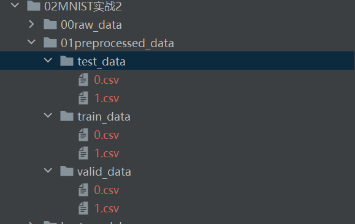

```python
def main():
    ''' 设置随机种子'''
    seed = 42
    torch.manual_seed(seed)
    np.random.seed(seed)
    random.seed(seed)

    ''' 设置超参数'''
    # 数据集默认就是在代码同级的
    # 这个路径和名字可以随便改，但是三者的顺序不能变动，一定是训练集、验证集、测试集 且都是只有最后一列是标签
    csv_paths = ['./01preprocessed_data/train_data/',
                 './01preprocessed_data/valid_data/',
                 './01preprocessed_data/test_data/']
    # 输入层
    input_size = 784 
    # 输出层
    output_size = 10
    # 训练次数
    epochs = 10
    # 学习率
    original_lr = 0.001
    # 耐心
    patience = 4
    # gpu设备
    cuda_id = 0
    # 学习率调整 epoch：lr
    lr_adjust = {
        2: 5e-5, 4: 1e-5, 6: 5e-6, 8: 1e-6,
        10: 5e-7, 15: 1e-7, 20: 5e-8
    }
    # 寻找最优网络结构次数
    search_net_num = 5

    for i in range(search_net_num):
        # 隐藏层 从前往后
        hidden_size = [random.randint(100, 125), random.randint(80, 85)]
        args = argparse(hidden_size=hidden_size, input_size=input_size, output_size=output_size,
                        epochs=epochs,
                        original_lr=original_lr, lr_adjust=lr_adjust, patience=patience, cuda_id=cuda_id)
        train(args, csv_paths)

```

这里因为我们的模型前向传播并没有用到input_size，所以这个怎么设置都无所谓

这里跟上一节的变化是改变了隐藏层，即`hidden_size = [random.randint(100, 125), random.randint(80, 85)]` 

其他参数与上一节一样。

## 全部代码

### 01pytorch_template.py

```python
'''
只需要更改模型和训练方式即可

以下函数和类已定义好，可以直接调用，以下的'保存'路径均不用考虑是否存在问题
评估：evaluate(dataloader, model, device, flag, criterion, optimizer=None, epoch=None, epochs=None):
    返回平均损失，某次batch的平均准确率，测试准确率（数组）,model,optimizer  flag='valid' / 'test' / 'train'
自定义数据集：Dataset_name(flag='train', csv_paths=None))
超参数类：argparse(self, csv_paths, hidden_size=None, lr_adjust=None, input_size=30, output_size=12, epochs=30,
                 original_lr=0.001,
                 patience=4, cuda_id=0):仅argparse.device="cuda:cuda_id" 其余返回值都跟参数名称一样
早停类：EarlyStopping(patience=7, verbose=False, delta=0) verbose是否打印信息 其对象属性值early_stop为True时表示早停
保存模型（保存）：save_checkpoint(model, optimizer, epoch=None, filepath='./best_model/1.pth')
加载模型：load_checkpoint(filepath, model, optimizer, device):model, optimizer, epoch,hidden_size
画图（保存）：save_figure(train_loss, train_epochs_loss, valid_epochs_loss,save_path="./total_loss_figs/1.png")
'''
import torchvision.utils

''' 导入包'''
import numpy as np
import torch
import torch.nn as nn
import torch.nn.functional as F  # 可以调用一些常见的函数，如非线性和池化等
import pandas as pd
from torch.utils.data import DataLoader, Dataset
from sklearn.model_selection import train_test_split
import matplotlib.pyplot as plt
import random
import os
from torchvision import transforms, datasets

'''导入自定义模板工具函数及类'''
from template_utils import Dataset_name, argparse, evaluate, EarlyStopping, load_checkpoint, save_figure, \
    save_checkpoint, calculate_accuracy


# --------------------------------------------   一般只用改下面的实现  -------------------------------------------------------------------
def imshow(img):
    img = img / 2 + 0.5
    print("img shape", img.shape)
    npimg = img.numpy()
    plt.imshow(np.transpose(npimg, (1, 2, 0)))
    plt.show()


''' 定义自己的模型'''


class Your_model_Name(nn.Module):
    # hidden_size是数组，另外两个是数字
    def __init__(self, input_size, hidden_size, output_size):
        super(Your_model_Name, self).__init__()
        self.input_size = input_size
        self.hidden_size = hidden_size
        self.output_size = output_size
        self.conv1 = nn.Conv2d(1, 6, 5)
        self.conv2 = nn.Conv2d(6, 16, 5)
        self.fc1 = nn.Linear(16 * 4 * 4, hidden_size[0])
        self.fc2 = nn.Linear(hidden_size[0], hidden_size[1])
        self.fc3 = nn.Linear(hidden_size[1], output_size)

        pass

    def forward(self, x):
        print("x forward shape ",x.shape) # x=64x1x28x28
        # x=x.view(x.size(0),-1)
        x = F.max_pool2d(F.relu(self.conv1(x)), (2, 2))  # 横纵方向步长为2  # x=64x6x12x12
        x = F.max_pool2d(F.relu(self.conv2(x)), 2)  # (2,2)也可以像这样写成2 # x=64x16x4x4
        x = x.view(-1, self.num_flat_features(x)) # x= 64x256

        x = F.relu(self.fc1(x))  # x= 64 x hidden_size[0]
        x = F.relu(self.fc2(x))  # x= 64 x hidden_size[1]
        x = self.fc3(x)   # x= 64 x output_size
        print("x shape ",x.shape)  # x = 64 x 10
        # print("x ",x)
        return x

    def num_flat_features(self, x): # x=64x16x4x4
        print("x1 shape",x.shape)
        size = x.size()[1:]  # 忽略第0维度，提取第1维度以及后面的维度
        print('size ',size) #size=16x4x4

        num_features = 1
        for s in size:
            num_features *= s
        print("num_features ",num_features)
        return num_features # num_features=256


def train(args, csv_paths):
    csv_files = os.listdir(csv_paths[0])
    csv_files.sort()

    train_total_acc = []
    valid_total_acc = []
    test_total_acc = []
    train_total_loss = []
    valid_total_loss = []
    test_total_loss = []
    '''实例化模型，设置loss，优化器等'''
    model = Your_model_Name(args.input_size, args.hidden_size, args.output_size).to(args.device)
    criterion = torch.nn.CrossEntropyLoss()
    optimizer = torch.optim.Adam(model.parameters(), lr=args.original_lr)
    early_stopping = EarlyStopping(patience=args.patience, verbose=True)

    for csv_file in csv_files:

        # 这个数据集只是单个文件的，即单个被试的，如果需要多个的话则需要自行改成循环结构
        # 数据加载
        transform = transforms.Compose([
            transforms.ToTensor(),
            transforms.Normalize((0.1307,), (0.3081,))
        ])
        train_dataset = datasets.MNIST('./data', train=True, download=True, transform=transform)
        test_dataset = datasets.MNIST('./data', train=False, transform=transform)
        train_dataloader = DataLoader(train_dataset, batch_size=64, shuffle=True)
        test_dataloader = DataLoader(test_dataset, batch_size=1000, shuffle=False)
        # 显示一个batch的训练集图片
        dataiter = iter(train_dataloader)
        images, labels = dataiter.__next__()
        print("images shape", images.shape)
        # imshow(torchvision.utils.make_grid(images))
        # 假设你想显示批次中的第一张图像
        # image_to_show = images[0]  # 获取第一张图像
        # imshow(image_to_show)  # 显示第一张图像

        train_epochs_loss = []
        valid_epochs_loss = []
        train_epochs_accuracy = []
        valid_epochs_accuracy = []

        for epoch in range(args.epochs):
            # ===================train===============================
            avg_loss, avg_acc, _, _, model, optimizer = evaluate(dataloader=train_dataloader, model=model,
                                                                 device=args.device,
                                                                 flag='train',
                                                                 criterion=criterion, optimizer=optimizer,
                                                                 epoch=epoch + 1,
                                                                 epochs=args.epochs)
            train_epochs_loss.append(avg_loss)
            train_epochs_accuracy.append(avg_acc)

            # =====================valid============================
            # avg_loss, avg_acc, _,_,_ = evaluate(dataloader=valid_dataloader, model=model, device=args.device,
            #                                 flag='valid',
            #                                 criterion=criterion)
            # valid_epochs_loss.append(avg_loss)
            # valid_epochs_accuracy.append(avg_acc)

            # ==================early stopping======================
            early_stopping(train_epochs_loss[-1], model=model,
                           path='./early_stop_model/' + str(round(avg_acc, 4)) + '.pth')
            if early_stopping.early_stop:
                print("Early stopping")
                break
            # ====================adjust lr========================
            if args.lr_adjust is not None:
                if epoch in args.lr_adjust.keys():
                    lr = args.lr_adjust[epoch]
                    for param_group in optimizer.param_groups:
                        param_group['lr'] = lr
                    print('Updating learning rate to {}'.format(lr))

        # ======================= 找到最佳模型 ===================================
        avg_loss, avg_acc, accs, test_losses, _, _ = evaluate(dataloader=test_dataloader, model=model,
                                                              device=args.device,
                                                              flag='test',
                                                              criterion=criterion)
        # ====================== 汇总 ====================================
        train_total_loss.append(np.average(train_epochs_loss))
        train_total_acc.append(np.average(train_epochs_accuracy))
        valid_total_loss.append(np.average(valid_epochs_loss))
        valid_total_acc.append(np.average(valid_epochs_accuracy))
        test_total_acc.append(avg_acc)
        test_total_loss.append(avg_loss)
        pre_acc = 0

        csv_path = './best_model/csvs/' + csv_file[:-4]
        if not os.path.exists(csv_path):
            os.mkdir(csv_path)
        best_model_files = os.listdir(csv_path)
        best_model_files.sort()
        now_acc = np.average(test_total_acc)
        if len(best_model_files):
            pre_acc = float(best_model_files[-1][:-4])
        if now_acc > pre_acc:
            save_figure(train_epochs_accuracy, valid_epochs_accuracy, accs,
                        save_path='./figures/csvs_acc_figs/' + csv_file[:-4] + '/' + str(round(now_acc, 4)) + '.png')
            save_figure(train_epochs_loss, valid_epochs_loss, test_losses,
                        save_path='./figures/csvs_loss_figs/' + csv_file[:-4] + '/' + str(round(now_acc, 4)) + '.png')
            save_checkpoint(model, optimizer, hidden_size=args.hidden_size,
                            filepath='./best_model/csvs/' + csv_file[:-4] + '/' + str(round(now_acc, 4)) + '.pth')

    pre_acc = 0
    best_model_files = os.listdir('./best_model/total/')
    best_model_files.sort()
    now_acc = np.average(test_total_acc)
    if len(best_model_files):
        pre_acc = float(best_model_files[-1][:-4])
    if now_acc > pre_acc:
        save_figure(train_total_acc, valid_total_acc, test_total_acc,
                    save_path='./figures/total_acc_figs/' + str(round(now_acc, 4)) + '.png')
        save_figure(train_total_loss, valid_total_loss, test_total_loss,
                    save_path='./figures/total_loss_figs/' + str(round(now_acc, 4)) + '.png')
        save_checkpoint(model, optimizer, hidden_size=args.hidden_size,
                        filepath='./best_model/total/' + str(round(now_acc, 4)) + '.pth')


def main():
    ''' 设置随机种子'''
    seed = 42
    torch.manual_seed(seed)
    np.random.seed(seed)
    random.seed(seed)

    ''' 设置超参数'''
    # 数据集默认就是在代码同级的
    # 这个路径和名字可以随便改，但是三者的顺序不能变动，一定是训练集、验证集、测试集 且都是只有最后一列是标签
    csv_paths = ['./01preprocessed_data/train_data/',
                 './01preprocessed_data/valid_data/',
                 './01preprocessed_data/test_data/']
    # 输入层
    input_size = 784
    # 输出层
    output_size = 10
    # 训练次数
    epochs = 10
    # 学习率
    original_lr = 0.001
    # 耐心
    patience = 4
    # gpu设备
    cuda_id = 0
    # 学习率调整 epoch：lr
    lr_adjust = {
        2: 5e-5, 4: 1e-5, 6: 5e-6, 8: 1e-6,
        10: 5e-7, 15: 1e-7, 20: 5e-8
    }
    # 寻找最优网络结构次数
    search_net_num = 5

    for i in range(search_net_num):
        # 隐藏层 从前往后
        hidden_size = [random.randint(100, 125), random.randint(80, 85)]
        args = argparse(hidden_size=hidden_size, input_size=input_size, output_size=output_size,
                        epochs=epochs,
                        original_lr=original_lr, lr_adjust=lr_adjust, patience=patience, cuda_id=cuda_id)
        train(args, csv_paths)


if __name__ == '__main__':
    main()

```


## 运行结果

### best_model

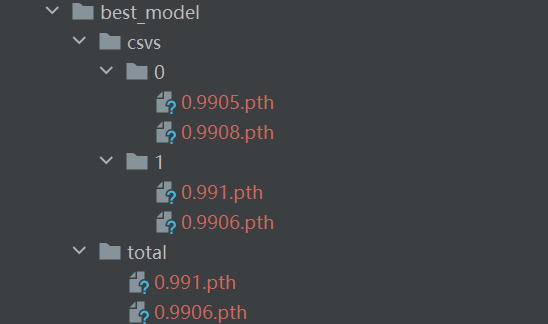

文件名即为准确率

如果要提取网络结构和参数只需调用下面封装好的函数即可：

```python
# filepath为pth路径，model是需要导入的模型
def load_checkpoint(filepath, model, optimizer, device):
    if not os.path.exists(filepath):
        print("该模型不存在")
    checkpoint = torch.load(filepath, map_location=device)
    model.load_state_dict(checkpoint['model_state_dict'])
    optimizer.load_state_dict(checkpoint['optimizer_state_dict'])
    epoch = checkpoint['epoch']
    print(f"Model loaded from {filepath}, epoch {epoch}")
    print("hidden_size=",checkpoint['hidden_size'])
    return model, optimizer, epoch,checkpoint['hidden_size']
```


### figure

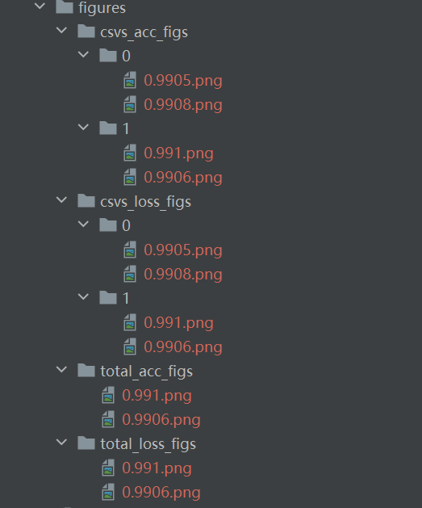

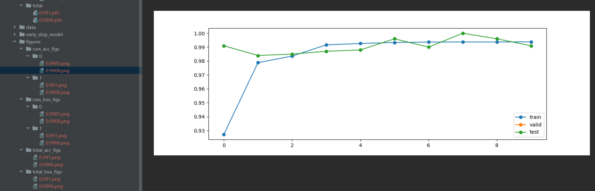

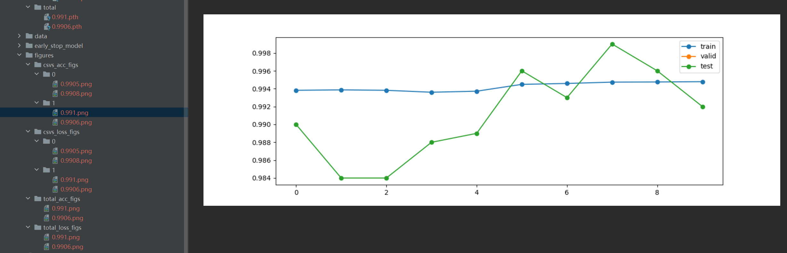

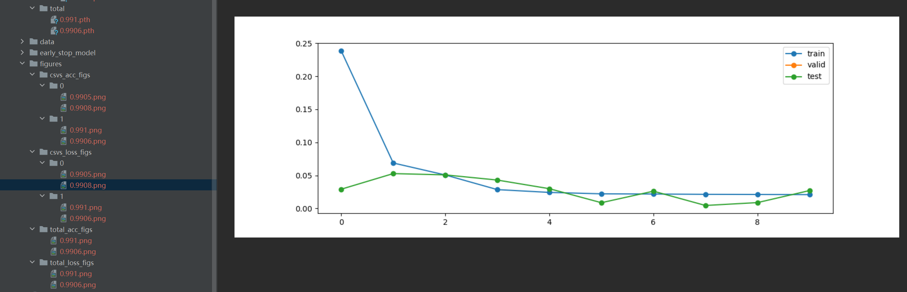

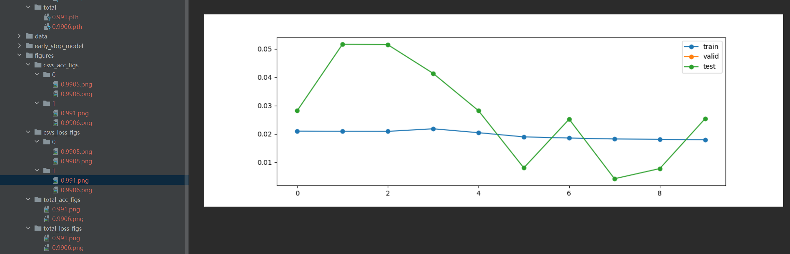

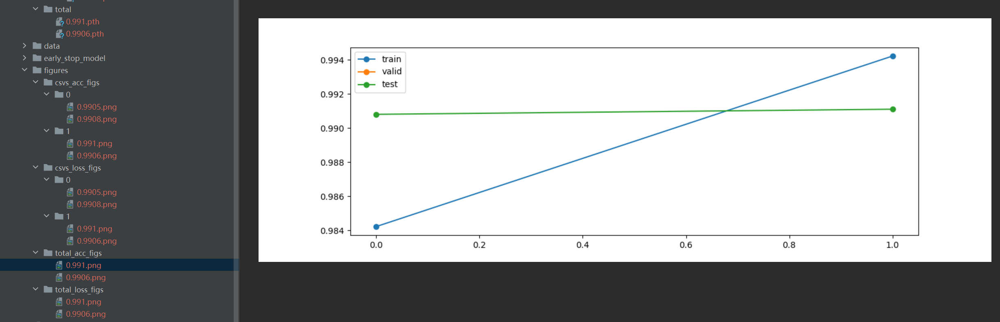

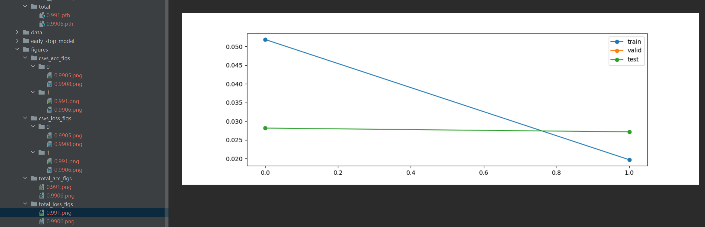

这里需要特别提醒，对于`total_acc_figs`和`total_loss_figs`的横坐标，我为了封装方便，也为了更具有泛化性，就没有指定横轴下标，而是都采用0-1的形式，比如在这里因为我是有2个csv文件，所以就只有2个点。

> 这里为什么我会采用多个csv来作为数据集的原因是因为我起初在做脑电研究的时候，每一个被试都是一个文件，所以多个被试就会形成多个文件，所以训练模型的时候就要训练所有被试，那么这样`total_acc_figs`和`total_loss_figs`就可以知道模型训练到不同被试的时候模型的效果怎么样了
>
> 实际上对于CV领域也是实用的。
>
> 这里使用csv文件是为了阅读数据方便，相比npz，csv文件的函数更加方便理解。而且我们采用的数据大多是二维数据，如果是多维数据的话可能就需要改成npz等格式了。如果是csv文件，我们规定最后一列都是标签，后续进行自定义数据集的项目的时候我会详细说这一部分的。


